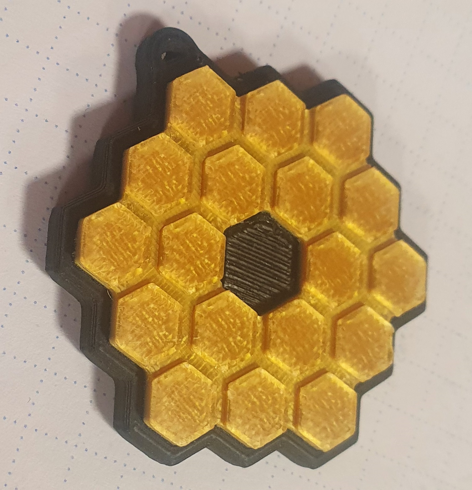
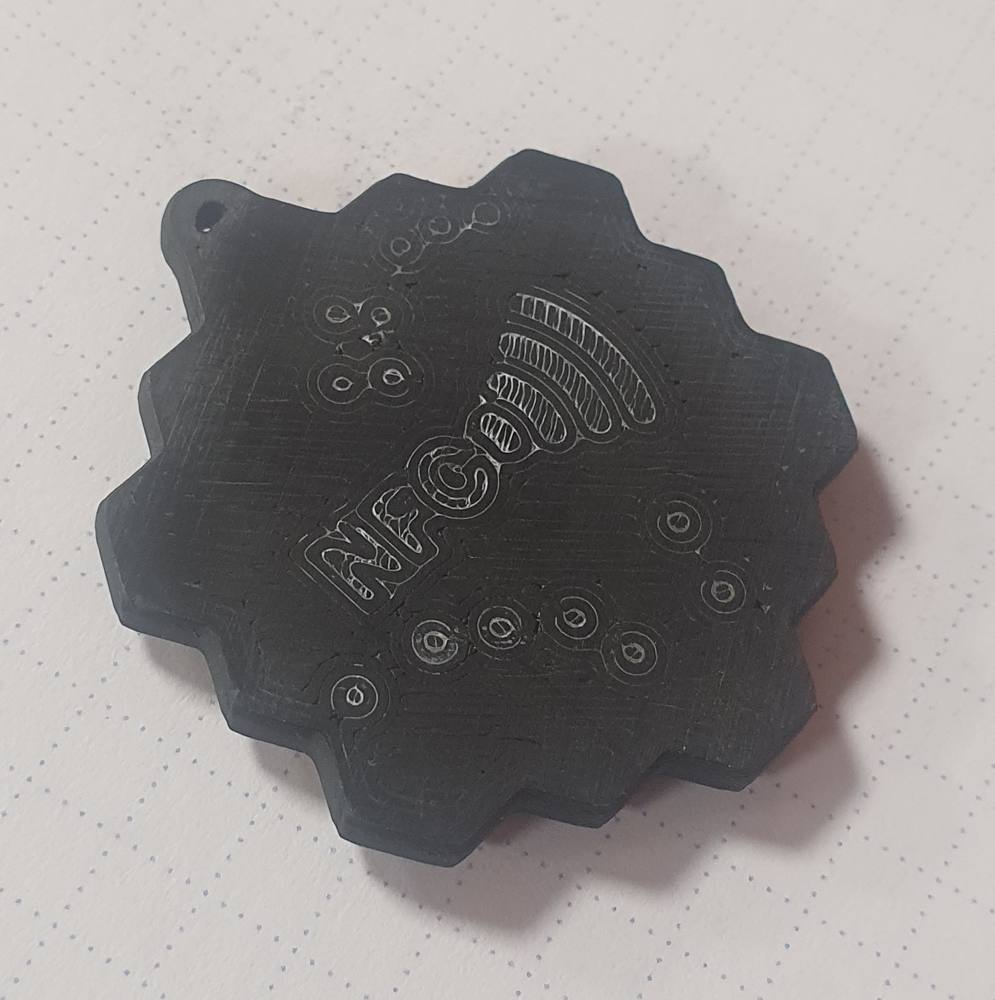

# JWST-Keychain
Keychain V3 front- and backside pictures

 

## James Webb Telescope Keychain
All you need to know about the JWST Mirror Keychain

Don't forget to add your contact information to the NFC chip in case you lose your keys

## Features of the Keychain
- pretty small and nerdy keychain (V3: 37 x 40 mm)
- looks like the JWST mirror assembly
- on the backside of the keychain is a NFC symbol - to ensure that the finder of your keychain recognizes that they can scan the tag and thus get your contact information.
- on the backside of the keychain are also the constellations of the Big Dipper and the Small Dipper
- NFC tag inside

## Used Components
- Black ABS eSun
https://www.amazon.de/3D-Drucker-Filament-Ma%C3%9Fgenauigkeit-3D-Druckstifte-Nachf%C3%BCller/dp/B07FQ5MC78
- Gold PLA Jayo
https://www.amazon.de/Filament-1-75mm-JAYO-Drucker-Shiny/dp/B08NX9HPRH
- UHU 2 component adhesive
https://www.amazon.de/UHU-Epoxidharz-Adhesive-2-K-Quick/dp/B07B4C4WDR
- Blank NFC Tags (NXP - Mifare Classic 1k)
https://de.aliexpress.com/item/1005004092253497.html
- Keychain (i recommend to use the 5 pcs 30 mm option)
https://de.aliexpress.com/item/1005003746857254.html

## How can i highlight the backside and make it more readable? 
Get yourself a white marker (i used an Edding 8055) or something like fluid Tipp-Ex.
"Re-Write" the constellations and the NFC text + symbol and let it cure.
After ~5 minutes you can just sand the backside carefully and read all the small details

## How2Print? 
0.4 mm Nozzle
0.1 mm Layer Height
100% Infill
No Supports needed (YOU NEED TO SWITCH THEM OFF IN YOUR SLICER OR YOU ARE NOT ABLE TO INSTALL THE NFC TAG!)

ABS Settings:
110 - 100°C Bed Temp
245°C Hot End

PLA
Standard Slicer Settings
55°C Bed

Printed with a Voron 2.4

## Changelog and tips for each version 
In the corresponding folder for each version are the STL files for 3D printing alongside the Fusion360 design files, in case you want to modify my design.
### +++++ V1 +++++ (NOT RECOMMENDED)
You have to print the Base and stop the print either manually or with the command M600 (Marlin) or PAUSE (Klipper) on Layer 21 (2.1 mm) to add the NFC Tag.
After that, just hit resume and let the base print.

It's possible that you are not able to print the Keychain v1, it's pretty tricky to get the overhangs just right.

You need to print the mirror file 18 times (print 20 and you have some spares on hand).

### +++++ V2 +++++
You have to print the Base and stop the print either manually or with the command M600 (Marlin) or PAUSE (Klipper) on Layer 21 (2.1 mm) to add the NFC Tag.
After that, just hit resume and let the base print.

Improved Design, position of NFC chip moved, no more problems with colapsing overhangs

about 10 ~ 15 mm smaller than version 1

You need to print the mirror file 18 times (print 20 and you have some spares on hand)

### +++++ V3 +++++
Improved and also recommended design, roughly 37 mm wide by 40 mm long

No pausing for NFC-Tag installation required, more realistic mirror design, mirrors are printed as one part

## Tips for the NFC tags 
All of my Samsung Phones (S9, S10e, A5) were not able to write to the NFC-Tag. But it worked without any problems on a OnePlus and a Xiaomi phone. 
In case you are having some trouble writing to the tag, just try another phone.
I recommend to use the App "NFC Tools" - It's also possible to secure the tags eventho the manufacturer says something else. You can add up to 1k of data, which is more than enough to store a vCard/contact, a link to the JWST galery website and some addition text information

## What's the story behind all of this?
Someone showed me a video of Urs Ganse (german video of "How to build a spacecraft": https://www.youtube.com/watch?v=5qNHtdN07FM - just in case you understand german and you are a nerd too: You need to watch it!)
In addition to that, we also spent a lot of time on one of the last warm summer days looking at the sky and the stars - you can learn a lot about constellations from somebody, who's hobby is sailing.
All the rest is just nerd stuff and some crazy ideas which lead to all of this. 

Enjoy your printed keychain :)

## License
Everybody is allowed to print and build one of these keychains for themselves or friends, etc. The commercial use of this project is strictly prohibited!